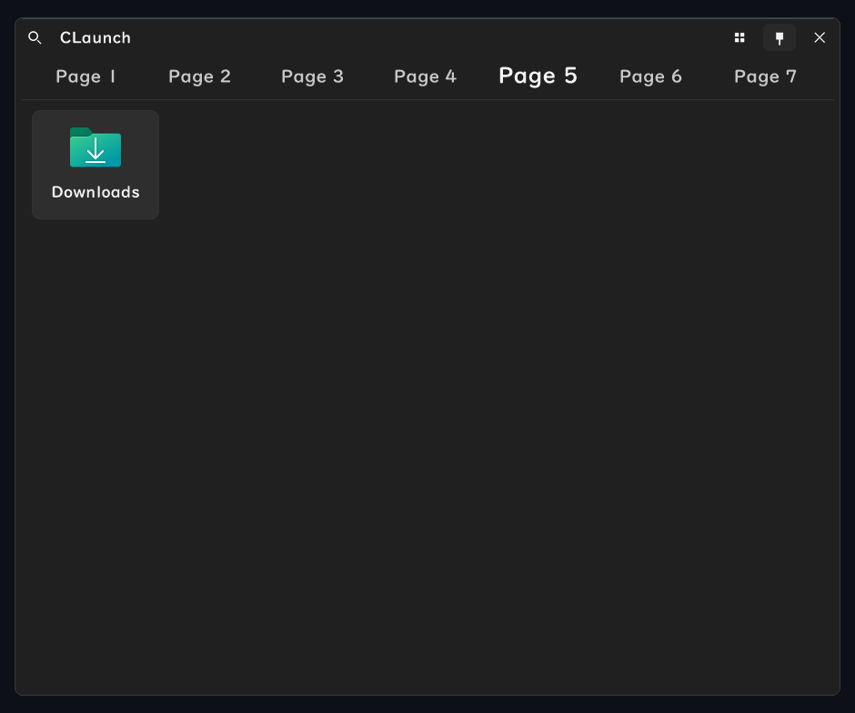

# README

> このプロジェクトはほぼAIによって構築されています。

CLaunch用のスキンを置いています。Releasesにあるzipをスキンのフォルダーに配置して、Claunchの設定からスキンを選んでください。

## Flat Dark



このスクショはデフォルト設定からフォント等を変更しています。

### ビルド

```powershell
uv sync
uv run python -m flat_dark.build
```

`dist/Flat Dark.zip`に出力されます。
